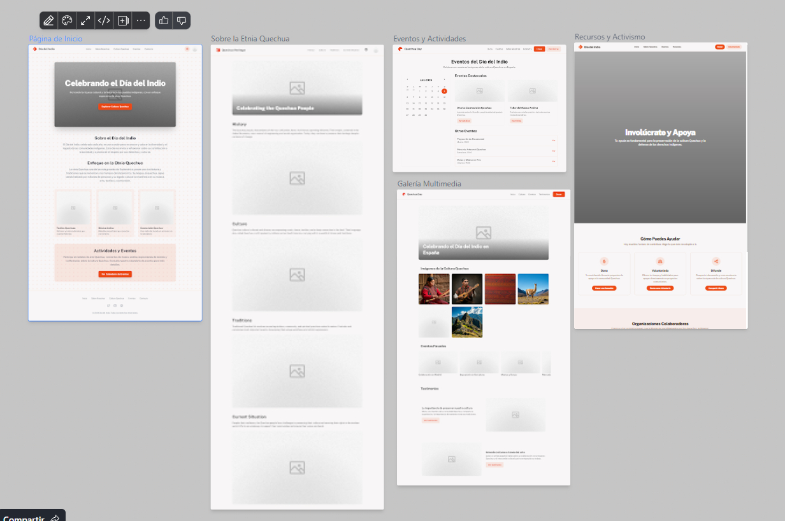
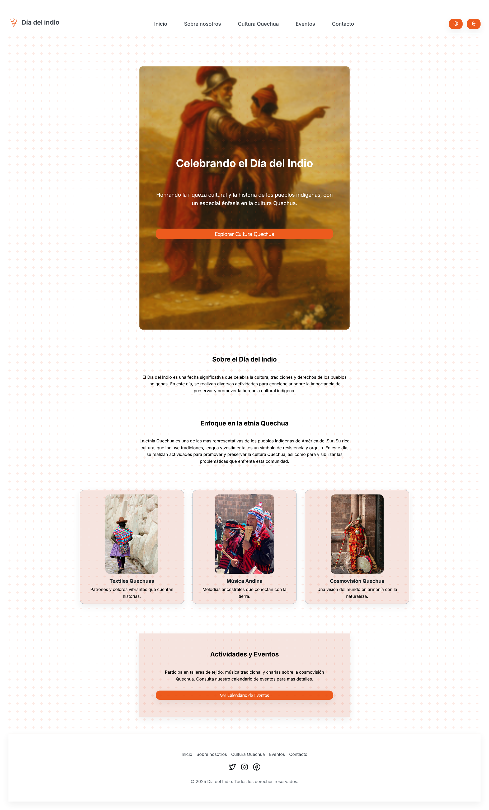

# JSCamp InfoJobs

Resolución de los ejercicios propuestos en el JSCamp de InfoJobs.

## El proyecto práctico

## Resultado provisional:

index:

eventos:

quechua:

recursos:

multimedia:

# TODO

- [] Maquetar eventos.html
- [] Maquetar quechua.html
- [] Maquetar recursos.html
- [] Maquetar multimedia.html

- probando commits para probar el n8n y su integración con GitHub mediante webhooks intento 2
